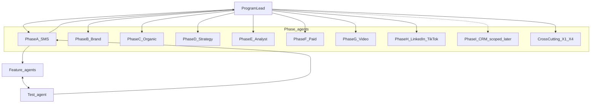

# Agent orchestration

How Kip foundation work is staffed. **No phase is complete until its feature agents are test-green and the phase agent has reported up.**

## Hierarchy

| Role | Responsibility |
|------|----------------|
| **Program lead** | Owns the plan, starts phase agents in ROI order, integrates cross-phase conflicts, marks todos done only after a fully green phase report |
| **Phase agent** | Owns one phase (A–H, or cross-cutting). Phase I is **scoped only** until scheduled. Spawns one feature agent per feature. Does not mark the phase done until every feature’s test agent passes |
| **Feature agent** | Implements exactly one feature. Hands work to its test agent. On FAIL, fixes and resubmits until green or blocked |
| **Test agent** | Does **not** implement product features. Runs acceptance: typecheck/tests, failure paths, SMS walkthrough notes. FAIL → defect list to the same feature agent. PASS → evidence back to feature → phase |

## Loop

1. Phase agent receives charter (scope + acceptance).
2. Spawns feature agents (parallel when they don’t edit the same files).
3. Feature implements → hands to test agent with changed files, commands, acceptance bullets.
4. Test verifies. FAIL → same feature agent. PASS → feature reports to phase.
5. All features PASS → phase smoke → report to program lead.
6. Program lead updates STATUS / plan and starts the next phase (or peer phases).

## Phase A feature tree (SMS cutover — done)

- **A1** Discord removal & channel config (`MESSAGE_CHANNEL`: `twilio` \| `linq`)
- **A2** Proactive loops → worker SMS (gap-fill, chase, competitor watch, niche plan, weekly digest)
- **A3** Twilio primary hardening
- **A4** Linq end-state path (worker drains `pending_inbound`)
- **A5** SMS deep-link connect kit (`/c/[token]`)
- **A6** (thin) Engagement draft approve/edit via SMS (`send` / edit verbs) — keep working; fuller polish is Phase I

## Later / cross-cutting

- **Phase H** — LinkedIn + TikTok outbound (Wave 3). See STATUS.
- **Phase I** — light CRM webhook + reply/lead polish — **scoped only**: [`PHASE_I_CRM_SCOPE.md`](PHASE_I_CRM_SCOPE.md).
- **X1–X4** — approvals absolute, quiet hours, `platformConfigured()` mock fallbacks, cohort go-live gate.

## Rules

- Feature agents do not mark phase todos done — only the program lead does.
- Test agents do not “fix forward” by rewriting product code without real behavior.
- If blocked on Meta Live / credentials, still ship mock-complete, then escalate.
- No skipping the test agent.
- Do **not** staff Phase I feature agents until the program lead schedules that wave.
