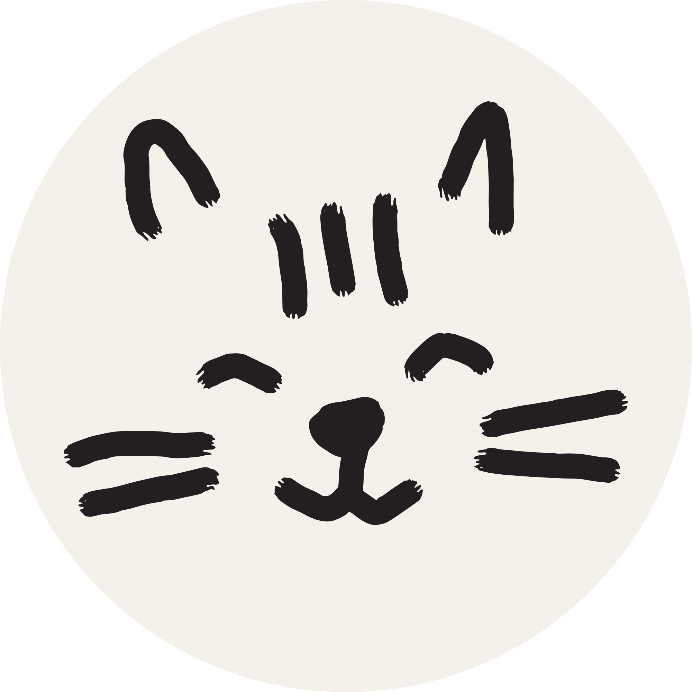

# Kip — design

  

Kip’s mark is a hand-drawn cat face in charcoal on a **circular off-white disc**. It is quiet on purpose: the cat is there if you look. Do not invert it, recolour it, add a bubble, or swap it for a lettermark.

The company behind Kip is Pulse Social Media. Pulse does not appear in the product UI. The old Pulse “P” with a heartbeat is retired.

## Mark

The cat is the logo. Charcoal strokes (`#202020`) on a circular off-white field (`#f4f1ea`). Square PNG, transparent corners, so the disc reads as a circle. Generous padding — no crop into the whiskers or ears. The Canva export is transparent charcoal; the master files composite it onto the disc.

| File | Use |
|---|---|
| `apps/web/public/brand/kip-logo.png` | Master (2000×2000). Headers, lockups, Open Graph. |
| `apps/web/public/brand/kip-logo-1024.png` | App stores and Meta app icon. |
| `apps/web/public/brand/kip-logo-transparent.png` | Stroke-only cat, for rebuilding the disc. |
| `apps/web/public/brand/kip-contact-avatar.png` | Messaging contact card (Linq / Twilio vCard). Opaque `#f4f1ea` square — transparent corners turn black in iMessage. |
| `apps/web/app/icon.png` | Favicon (512). |
| `apps/web/app/apple-icon.png` | Apple touch icon (180). |

In the app, render the mark through `BrandLockup` / `KipMark`. Do not inline a one-off `` of a different file.

### Clear space and size

- Keep at least a quarter of the mark’s width as empty space around the disc.
- Smallest size in UI: **24px**. Below that the whiskers collapse.
- The disc stays circular on every surface — black landing, paper app chrome, photography. Do not square it off.

### Don’t

- Don’t invert to a white cat.
- Don’t drop the disc for a black or coloured square.
- Don’t add a chat bubble, spark, or “K”.
- Don’t redraw it in a geometric / “tech” style.
- Don’t lock it up with “Pulse”, “Pulse AI”, or “Pulsepilot”.

## Wordmark

**Kip** — one syllable, capital K, no all-caps, no “KIP AI”.

- Type: SF Pro / system UI sans (`-apple-system`, `"SF Pro Text"`, `"SF Pro Display"`).
- Weight: 600.
- Tracking: `-0.02em`.
- Colour: white on black, `#1d1d1f` on paper.

The standard lockup is the circular mark, then the word, 9–10px gap, vertically centred. That is `BrandLockup`.

## Colour

Kip’s own surfaces stay near-black and paper. Client brands bring their own colour; we don’t.

| Token | Hex | Use |
|---|---|---|
| Black | `#000000` | Landing |
| Disc | `#f4f1ea` | Logo circle only |
| Ink | `#1d1d1f` | Body on light |
| Paper | `#ffffff` / `#f6f7f9` | App chrome |
| Mute | `#6e6e73` | Secondary |
| Line | `#ececec` | Hairline rules |
| Cat | `#202020` | Logo strokes only |

No brand orange, no purple gradient, no Facebook blue in Kip chrome (the demo `/feed` page is a mock social network and is allowed to look like one).

## Type and layout

- Headlines: SF Pro, 600, tight tracking, large and short. Landing: “Text a photo. It’s posted.”
- Body: 15px-ish, 1.4–1.45 line height, antialiased.
- Corners: 8–16px on UI chrome. The logo itself is a circle, not a rounded square.
- Motion: one small rise on the landing headline. Nothing bouncy. Respect `prefers-reduced-motion`.

## Voice (when the mark is next to copy)

Kip texts like a switched-on mate. Warm, sharp, owns the work, owns being an AI. No em dashes, no markdown, no feature menus in customer-facing messages. A short rundown of days or posts is fine. Full rules live in `packages/orchestrator/src/persona.ts` — design should not fight that voice with agency-speak or “we’re a platform” chrome.

## Photography

The landing hero is a real photo (`thread-photo.jpg`), full-bleed, with the product thread overlaid. Photography should feel like something a shop would actually post — not stock-AI gloss. The off-white disc sits in the corner; it does not get a colourful overlay.

## Where it appears

- Marketing landing (`/`) nav and anywhere we need a home control
- Operator console top bar (`/app`)
- Log in, sign up, verify-code
- Privacy, terms, data deletion
- Demo feed
- Favicon / Apple icon
- Meta / store icon (`kip-logo-1024.png`)
