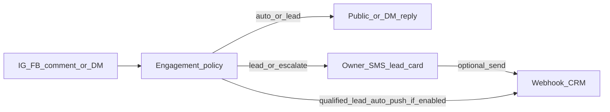

# Phase I — Comments, DMs, leads → light CRM (scoped later)

**Status:** scoped only — **do not build a full CRM in this wave.**  
Thin SMS reply approve/edit already ships with Phase A (**A6**). This doc parks the rest until Phase I is scheduled.

Pairs with [`STATUS.md`](STATUS.md) and [`ROADMAP.md`](ROADMAP.md).

---

## Already built (keep; do not regress)

- Policy engine in `packages/orchestrator/src/engagement.ts`: comment / DM / mention / review → `auto` / `draft` / `escalate` / `hide`
- Lead bucket: helpful public reply + owner SMS handoff with a one-line summary
- Support / general / spam routing; sentiment safety rails; `interactions` + `interaction_replies`
- Worker engagement loop + Meta webhook ingestion (IG / FB)
- **Thin A6 SMS path** in `processInbound.ts`:
  - `"send"` / `"send it"` / `"post it"` → `sendLatestDraft`
  - edit verbs (no pending post) → `editLatestDraft`
  - Clarify copy when a drafted engagement reply is waiting

---

## What “good” looks like (without becoming a CRM)

Kip stays the **inbox + qualifier**. The owner (or their CRM) owns the sale.

1. Answer simple inquiries on-brand from business facts
2. Never invent prices / availability — draft or escalate instead
3. Spot intent (book / buy / quote / call) and hand a clean **lead card** to the owner in SMS
4. Optionally **push that same card to a CRM** so the owner doesn’t re-type it

---

## In scope for Phase I (when scheduled)

| Id | Work |
|----|------|
| **I1** | SMS reply verbs polish — “approve that reply”, “send this instead…”, “I’ll take it”, “mark as spam” (beyond thin A6 `send` / edit) |
| **I2** | **Lead card shape** (stable): name/handle, platform, channel (comment vs DM), intent, summary, suggested next step, permalink when available, timestamp |
| **I3** | **Thin CRM webhook** (one mechanism): owner pastes a Zapier / Make / n8n / HubSpot / Pipedrive catch-hook URL via SMS deep-link settings; on qualified lead (or owner “send to CRM”) POST JSON lead card; SMS confirms success/failure; optional email fallback if webhook unset |
| **I4** | Feature toggles: existing `auto_replies`, `lead_handoff` + **`crm_webhook`**; failure SMS + audit row for CRM pushes |
| — | Meta App Review: keep messaging / comment scopes + screencasts valid after SMS cutover |

Stub type field today: `brands.features.crm_webhook` (boolean) — **no runtime webhook implementation yet**. See TODO in `engagement.ts`.

### Lead → CRM flow (target, later)

---

## Explicitly out of scope (do not build)

- Full CRM inside Kip (pipelines, deal stages, tasks, sequences)
- Native HubSpot / Salesforce OAuth sync / two-way contact merge
- Sales dialer, quoting, payments, calendar booking bots beyond “here’s our booking link from facts”
- Scraping competitor comment sections / cold outbound DMs
- LinkedIn / TikTok inbound engagement (outbound-only in Phase H; inbound later if ever)

---

## Acceptance checklist (parked until Phase I is scheduled)

- [ ] Comment + DM paths work end-to-end on SMS-led Kip (mock + live Meta)
- [ ] Lead card always lands in owner SMS with enough to act (who / what / where)
- [ ] Owner can approve / edit draft replies from SMS (polish beyond A6)
- [ ] Webhook CRM push succeeds with signed/simple JSON; failures SMS the owner
- [ ] Toggles can disable auto-replies or CRM push without breaking triage
- [ ] No Kip-owned pipeline UI required
