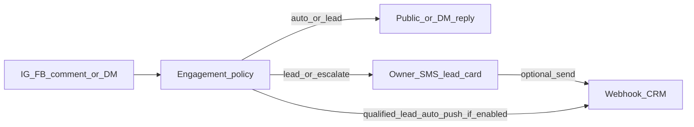

# Phase I — Comments, DMs, leads → light CRM

**Status:** ✅ **IMPLEMENTED** (I1–I4) on this branch — thin CRM webhook + SMS polish. **Not** a full CRM.

Pairs with [`STATUS.md`](STATUS.md) and [`ROADMAP.md`](ROADMAP.md).

---

## Already built (keep; do not regress)

- Policy engine in `packages/orchestrator/src/engagement.ts`: comment / DM / mention / review → `auto` / `draft` / `escalate` / `hide`
- Lead bucket: helpful public reply + owner SMS handoff with a **stable lead card**
- Support / general / spam routing; sentiment safety rails; `interactions` + `interaction_replies`
- Worker engagement loop + Meta webhook ingestion (IG / FB)
- **Thin A6 SMS path** in `processInbound.ts` (still works):
  - `"send"` / `"send it"` / `"post it"` → `sendLatestDraft`
  - edit verbs (no pending post) → `editLatestDraft`
  - Clarify copy when a drafted engagement reply is waiting

---

## What “good” looks like (without becoming a CRM)

Kip stays the **inbox + qualifier**. The owner (or their CRM) owns the sale.

1. Answer simple inquiries on-brand from business facts
2. Never invent prices / availability — draft or escalate instead
3. Spot intent (book / buy / quote / call) and hand a clean **lead card** to the owner in SMS
4. Optionally **push that same card to a CRM** so the owner doesn’t re-type it

---

## In scope for Phase I

| Id | Work | Status |
|----|------|--------|
| **I1** | SMS reply verbs polish — “approve that reply”, “send this instead…”, “I’ll take it”, “mark as spam” (beyond thin A6 `send` / edit) | ✅ **IMPLEMENTED** |
| **I2** | **Lead card shape** (stable): handle, platform, channel, intent, summary, next_step, permalink, timestamp | ✅ **IMPLEMENTED** (`leadCard.ts`) |
| **I3** | **Thin CRM webhook**: SMS `set crm webhook <url>` / deep-link `/c/crm`; on qualified lead or “send to CRM” POST JSON; SMS confirm; optional `EMAIL_FROM` email fallback | ✅ **IMPLEMENTED** (`crmWebhook.ts`, migration `0038_crm_webhook.sql`) |
| **I4** | Feature toggles: `auto_replies`, `lead_handoff`, `crm_webhook`; failure SMS + `crm_push_log` audit | ✅ **IMPLEMENTED** |
| — | Meta App Review: keep messaging / comment scopes + screencasts valid after SMS cutover | (ops, not code) |

Runtime: `brands.crm_webhook_url` (encrypted https catch-hook) + `brands.features.crm_webhook`.

### Lead → CRM flow

---

## Explicitly out of scope (do not build)

- Full CRM inside Kip (pipelines, deal stages, tasks, sequences)
- Native HubSpot / Salesforce OAuth sync / two-way contact merge
- Sales dialer, quoting, payments, calendar booking bots beyond “here’s our booking link from facts”
- Scraping competitor comment sections / cold outbound DMs
- LinkedIn / TikTok inbound engagement (outbound-only in Phase H; inbound later if ever)

---

## Acceptance checklist

- [x] Lead card always lands in owner SMS with enough to act (who / what / where) when `lead_handoff` is on
- [x] Owner can approve / edit / replace draft replies from SMS (I1 polish beyond A6)
- [x] Webhook CRM push succeeds with stable JSON; failures SMS the owner; `crm_push_log` audit row
- [x] Toggles can disable auto-replies, lead handoff, or CRM push without breaking triage
- [x] No Kip-owned pipeline UI required
- [ ] Comment + DM paths work end-to-end on SMS-led Kip (mock + live Meta) — live gated on App Review
